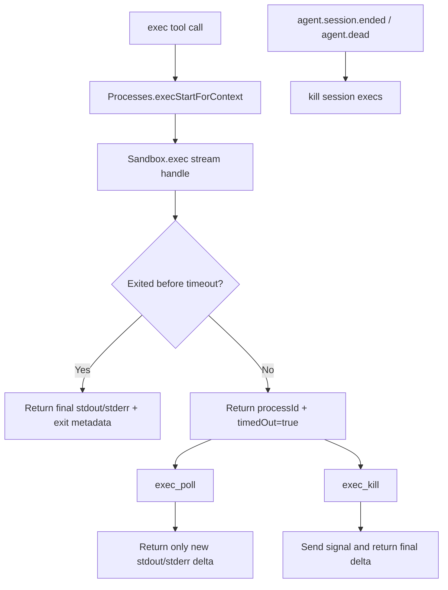

# Session Exec Polling

This change adds Codex-style foreground exec lifecycle handling to the shell plugin without turning commands into
durable daemon processes.

## What Changed

- `exec` now starts a session-scoped process through `Processes`.
- If the command exits before `timeoutMs`, `exec` returns the final output as before.
- If the command is still running at `timeoutMs`, `exec` returns a cuid2 `processId` and keeps the process attached to
  the current agent session.
- `exec_poll` waits for more output from that `processId` and only returns logs that changed since the previous
  `exec`/`exec_poll`/`exec_kill` call.
- `exec_kill` sends a signal to the running process and returns any final output captured while it exits.
- Session-scoped execs are killed automatically when the owning session ends (`reset`, `compaction`) or the agent dies.

## Flow

## Notes

- `detachOnTimeout=false` restores the old behavior where timeout stops the command instead of keeping it alive.
- The in-memory process state is intentionally session-bound and is not persisted across engine restarts.
