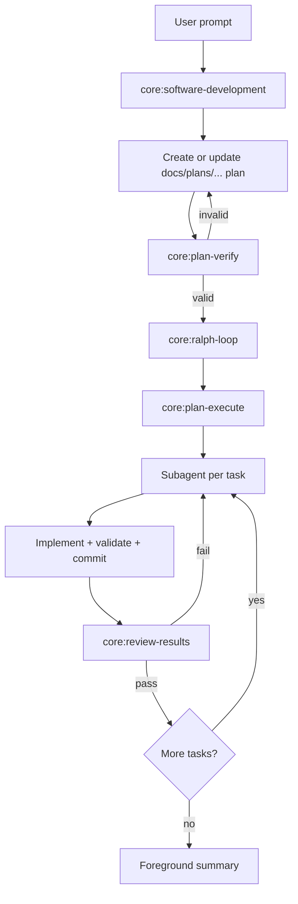

# Software Development Workflow

Software development now has a dedicated entry task for raw user requests. The intended flow is no
longer "edit immediately in the foreground agent"; it is "plan first, validate, then delegate
implementation to the Ralph loop."

Foreground-agent policy:

- create or update the plan first
- never start non-trivial implementation before `core:plan-verify` passes
- use subagents for implementation
- keep commits task-scoped instead of batching the whole feature into one commit
