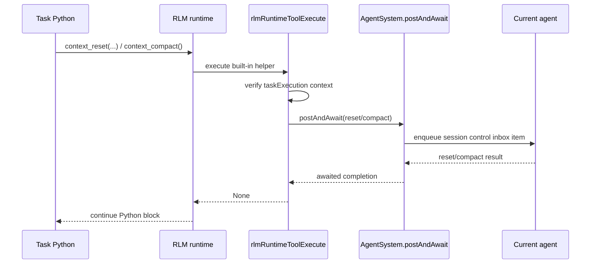

# Task Context Runtime Helpers

## Summary

Tasks now have two additional built-in Python runtime helpers for managing the current agent session:

- `context_reset(message=None)` resets the current agent session from inside task code
- `context_compact()` runs manual compaction on the current agent session and waits for completion
- both helpers are task-only, matching the existing `step(prompt)` runtime guard

## Flow

## Notes

- Outside task execution, `context_reset()` throws `context_reset() is allowed only in tasks.`
- Outside task execution, `context_compact()` throws `context_compact() is allowed only in tasks.`
- `context_reset()` accepts an optional seed message for the fresh context; omitting it clears the session completely.
