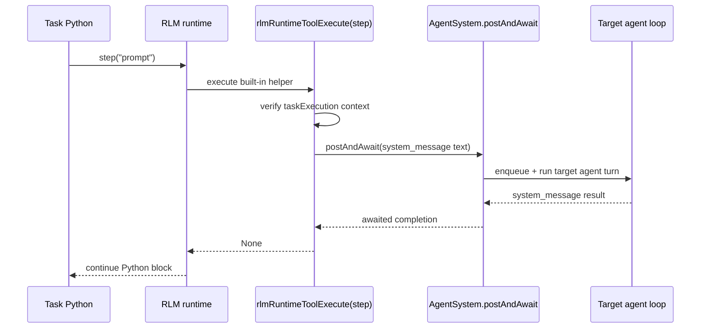

# Task Step Runtime Helper

## Summary

Tasks now have a built-in `step(prompt)` helper in the Python runtime.

- `step(prompt)` is executed as an inline RLM runtime helper
- it is allowed only when the current Python block is running as a task execution
- it sends a plain `system_message` prompt to the current target agent
- it waits for that agent turn to complete before returning to the task
- it returns no value to task code

## Flow

## Notes

- Outside task execution, `step(prompt)` throws `step() is allowed only in tasks.`
- The helper is separate from `skip()`: `step()` continues the task after the awaited agent turn finishes.
