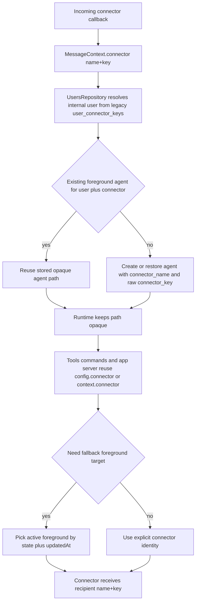

# Agent Connector Identity

## Summary
- Runtime connector identity now uses `connector: { name, key }` instead of namespaced `connectorKey` strings.
- `MessageContext`, agent config, tool payloads, plugin prompt context, and connector send/draft/reaction APIs all carry the structured connector object.
- Foreground connector agents persist `connector_name` and raw `connector_key` separately, so multiple connectors can reuse the same key value safely.
- Foreground agent fallbacks now choose the most recently active foreground agent instead of preferring Telegram by connector name.
- Incoming connector callbacks resolve users only from `MessageContext.connector`, never from route path parsing.
- The `users` table remains the only legacy exception: `user_connector_keys.connector_key` still stores namespaced strings internally, but that format is hidden behind `UsersRepository`.
- The backfill migration now writes raw agent `connector_key` values and only uses the single-key fallback when every historical connector-agent version for that user is compatible with the same raw key.

## Flow

## Why
- `AgentPath` remains an opaque routing key instead of a hidden source of recipient identity.
- Connector identity is explicit at every runtime boundary, so the same raw key can exist on multiple connectors without ambiguity.
- Foreground fallbacks now follow real activity ordering rather than connector-specific priority rules.
- Legacy namespaced user connector keys stay isolated inside the user repository instead of leaking into app, engine, tool, or connector code.
- Legacy path parsing is isolated to the one-time storage migration instead of living in runtime message handling.
