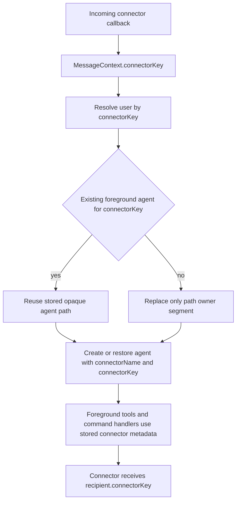

# Agent Connector Keys

## Summary
- Foreground connector agents now persist `config.connectorKey` as explicit recipient metadata.
- Incoming connector callbacks canonicalize user scope from `MessageContext.connectorKey`, not from path suffix parsing.
- Connectors emit the plain connector route path while `connectorKey` carries the recipient identity.
- Connector slash commands and app-link replies now reuse resolved connector identity instead of reparsing user scope from route paths.
- Outgoing connector sends, drafts, typing, and reactions now resolve recipients from stored agent config or explicit message context.
- The storage migration backfills `agents.connector_key` once for legacy rows so runtime code no longer needs path-derived connector fallbacks.

## Flow

## Why
- `AgentPath` remains an opaque routing key instead of a hidden source of recipient identity.
- Connector recipient resolution becomes deterministic for users with multiple keys on the same connector.
- Legacy path parsing is isolated to the one-time storage migration instead of living in runtime message handling.
