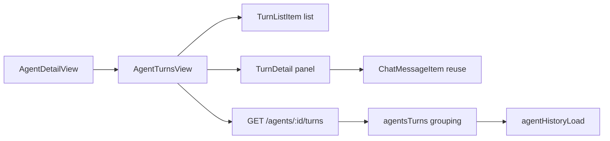

# Agent Turn-Based History

Date: 2026-03-12

## Summary

Replaced the chat-like message view in agent detail pages with a turn-based history browser. Each turn groups records from a `user_message` through all subsequent inference records until the next `user_message`.

## Motivation

Agents are not chat conversations — they process incoming messages and produce responses across tool calls, RLM executions, and assistant replies. A turn-based view better represents this structure, showing each interaction as a discrete unit rather than a flat message stream.

Chat remains available for direct chat use cases.

## Changes

### Backend

- **`GET /agents/:id/turns`** — new API endpoint that loads all history for an agent and groups it into turns. No database changes required; grouping is computed from the flat `session_history` records.

### App

- New `turns` module (`packages/daycare-app/sources/modules/turns/`) with:
  - `turnTypes.ts` — `AgentTurn` type
  - `turnsApi.ts` — API client
  - `turnsStoreCreate.ts` — Zustand store with open/poll/selectTurn
  - `turnsContext.ts` — React hooks
  - `AgentTurnsView.tsx` — two-panel master-detail view
  - `TurnListItem.tsx` — turn list row
  - `TurnDetail.tsx` — turn detail with records in reverse order

- `AgentDetailView` now renders `AgentTurnsView` instead of `Chat`.

## Architecture

## Turn Grouping Logic

1. Sort history records ascending by timestamp
2. Each `user_message` starts a new turn
3. Records before the first `user_message` form an initial turn with empty preview
4. Each turn contains: `index`, `startedAt`, `preview` (user message text), `records`
