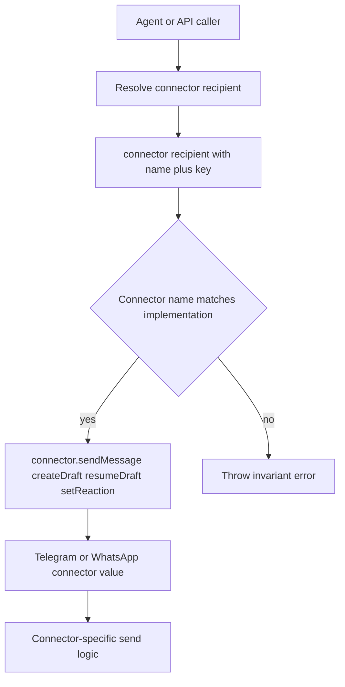

# Connector Recipients

## Summary
- Removed raw connector routing ids from connector send/draft/reaction APIs.
- Connector callers now pass `recipient.name` and `recipient.key`.
- Telegram and WhatsApp resolve their connector-specific send target directly from that structured recipient.
- Connectors now validate that `recipient.name` matches the connector implementation before using `recipient.key`.
- App and SSE consumers should use explicit connector metadata rather than inferring connector identity from agent paths.
- The old namespaced `connectorKey` value is no longer part of the connector contract.

## Flow

## Why
- The engine already stores connector identity as `connector.name` plus raw `connector.key`.
- Passing the structured recipient through connector APIs avoids reparsing namespaced strings at every caller.
- Connector-local validation keeps connector-specific parsing and allowlist behavior in one place while still failing fast on transport mismatches.
- The app can treat agent paths as opaque because connector identity now arrives explicitly in the agent list and sync payloads.
