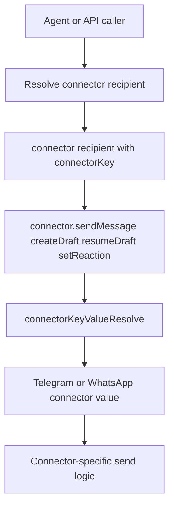

# Connector Recipient Keys

## Summary
- Removed raw connector routing ids from connector send/draft/reaction APIs.
- Connector callers now pass `recipient.connectorKey`, which keeps connector routing aligned with stored user connector keys.
- Telegram and WhatsApp now resolve their connector-specific value inside the connector implementation.

## Flow

## Why
- The engine already stores connector identity as `connectorKey`.
- Passing the same key through connector APIs avoids re-deriving connector values at every caller.
- Connector-local resolution keeps connector-specific parsing and allowlist behavior in one place.
