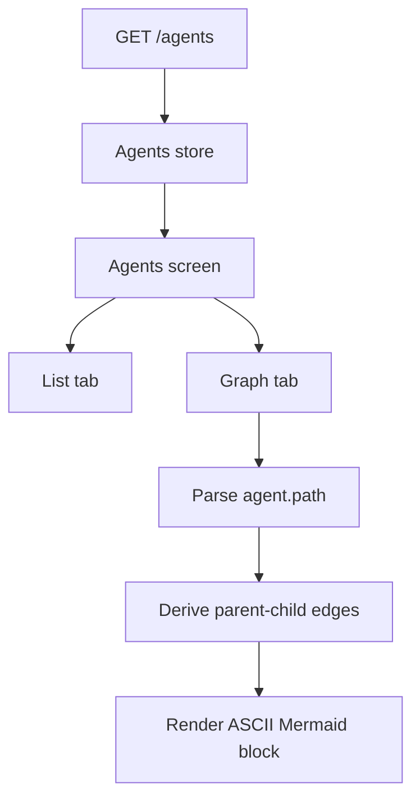
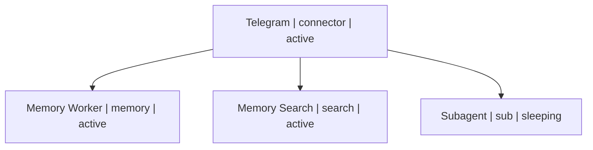

# App Agents Graph Tab

## Summary

Added a second tab to the app's Agents screen so operators can switch between:

- the existing grouped card list
- a path-derived Mermaid graph rendered as selectable ASCII text

The graph is built entirely from `agent.path`, so child agents such as `sub`, `memory`, and `search` now appear
under their parent node without adding new API fields.

## Flow

## Example

