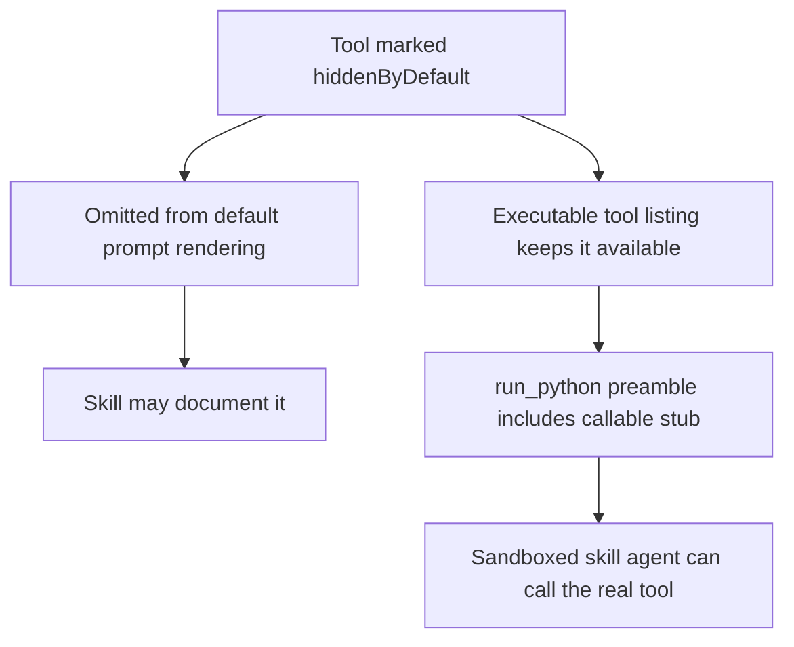

# Hidden Tools Runtime Access

Fixed the Python runtime so hidden-by-default tools remain executable for agents and sandboxed skills even when they are omitted from the default prompt.

## Changes

- Added a separate execution-time tool listing path that ignores `hiddenByDefault`.
- Kept `visibleByDefault` checks for contextual restrictions such as foreground-only tools.
- Switched Python runtime tool resolution and `run_python` block preambles to use the execution-time list.
