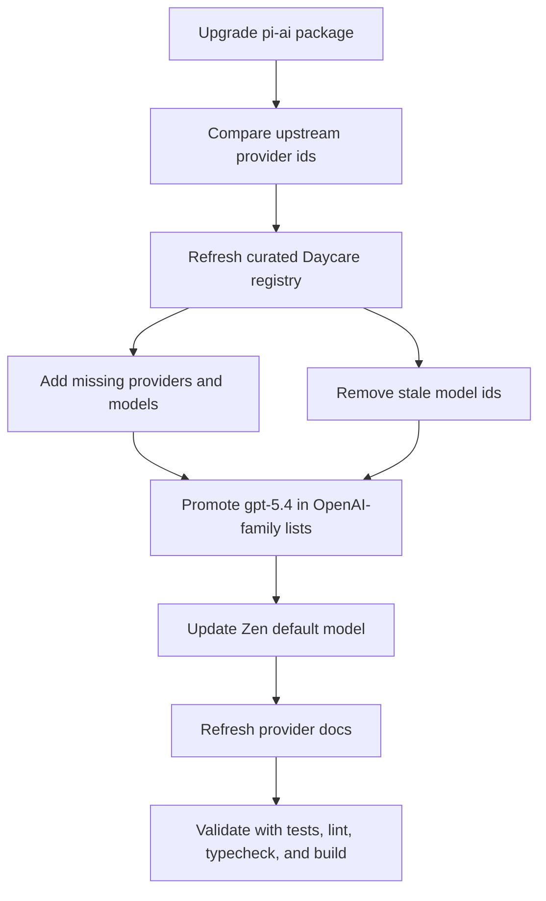

# pi-ai GPT-5.4 Refresh

## Summary
- Upgraded `@mariozechner/pi-ai` from `0.55.3` to `0.57.1`.
- Manually refreshed the curated provider registry in `packages/daycare/sources/providers/models.ts` to match the new upstream catalog.
- Promoted `gpt-5.4` and `gpt-5.4-pro` to the front of OpenAI-family provider lists.
- Added the new `opencode-go` provider block from the upstream catalog.
- Updated the custom Zen provider to default to `gpt-5.4` and documented the newer GPT listings in provider docs.

## Catalog Flow

