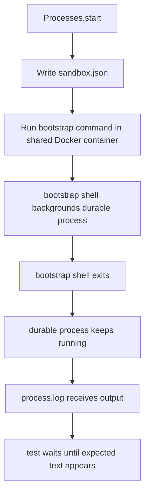

# Sandbox Process Startup

The managed process flake came from the sandbox-backed startup path, not from the log reader itself.

## Failure Mode

- `Processes.start()` launched durable processes through the generic sandbox exec path.
- That exec path wraps the command in an exec supervisor that cleans up the shell process tree when the startup command exits.
- The durable process startup command backgrounds the actual managed process and returns immediately with the child pid.
- The supervisor cleanup then races with that backgrounded process and can kill it before `process.log` is created or populated.

## Fix

- Sandbox process startup now uses the shared Docker container exec path directly for the one-time bootstrap command.
- The runtime still writes the same `sandbox.json` metadata and still uses the sandbox control path for status, stop, and remove operations.
- The process spec now polls for expected log content instead of assuming a fixed sleep is long enough.

## Outcome

- The sandbox runtime no longer tears down the managed process during startup.
- The spec is synchronized to actual process output instead of wall-clock timing.
