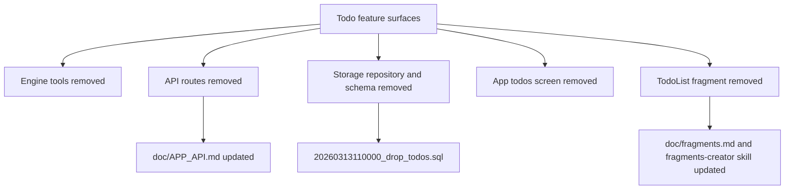

# Todo Feature Removal

Date: 2026-03-13

Removed the todo feature from the core runtime, app API, and app UI.

- Deleted all todo tools and their system-prompt guidance.
- Removed todo storage, API routes, and the `todos` database table via a new drop migration.
- Removed the dedicated todos screen and the `TodoList` fragment component from the app and fragment catalog.
- Updated public docs and fragment authoring guidance so todo-specific APIs and components are no longer advertised.

