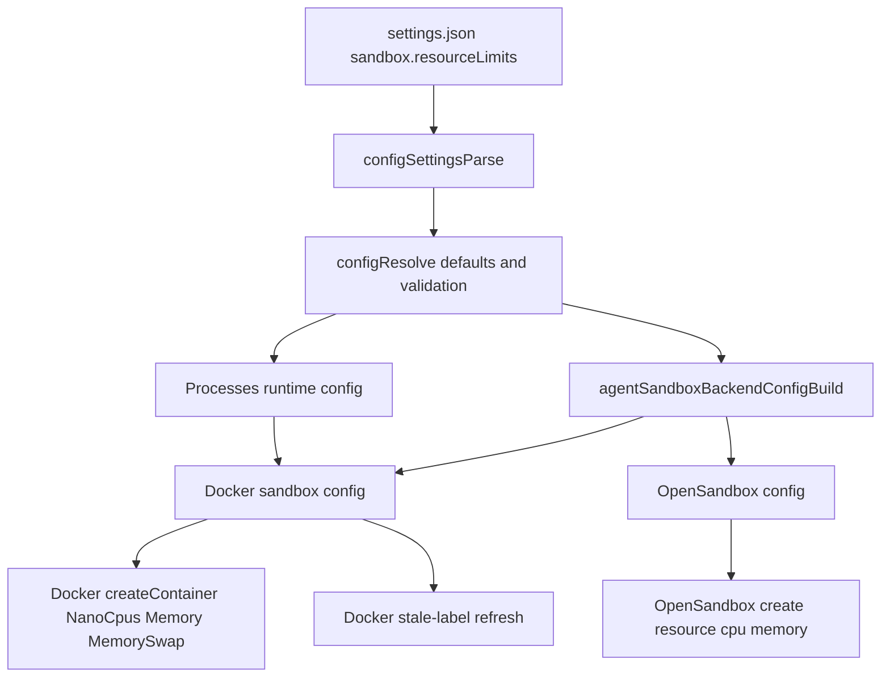

# Sandbox Resource Limits

## Summary

- Added shared `sandbox.resourceLimits` settings with defaults of `cpu: 4` and `memory: "16Gi"`.
- Applied the limits to both Docker and OpenSandbox runtimes.
- Docker sandbox containers now refresh when resource-limit labels drift so existing sandboxes pick up new caps.
- Durable process sandboxes now inherit the same default resource limits.

## Settings

```json
{
    "sandbox": {
        "backend": "docker",
        "resourceLimits": {
            "cpu": 4,
            "memory": "16Gi"
        }
    }
}
```

`memory` accepts byte strings such as `16Gi`, `8GB`, or `512Mi`.

## Flow



## Notes

- Docker uses `NanoCpus` and `Memory`/`MemorySwap` so the memory cap is enforced as a hard ceiling.
- OpenSandbox receives the same logical limits through its `resource` create options.
