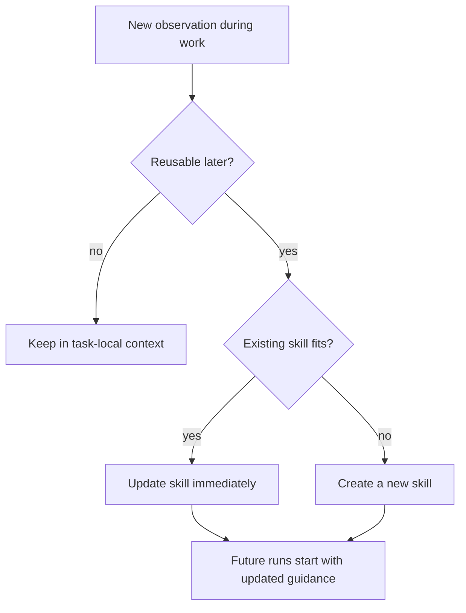

# Skill-First System Prompt

Strengthened the core prompt so reusable know-how is treated as skill material by default, not as disposable chat context.

## Changes

- `packages/daycare/sources/prompts/SYSTEM_SKILLS.md`: added explicit rules that skills are the default home for repeated workflows, tool usage patterns, outages, format drift, and durable troubleshooting knowledge.
- `packages/daycare/sources/prompts/AGENTS.md`: reinforced that reusable operational learning should be written back to skills while context is fresh, and that new tools should be paired with skill guidance.
- `packages/daycare/sources/skills/software-development/skill-creator/SKILL.md`: updated the built-in authoring guidance so skill maintenance is continuous, with concrete triggers such as server failures, format changes, and tool workarounds.

## Intent

- Make "everything reusable should become a skill" part of the default agent behavior.
- Reduce repeated rediscovery of outages, schema drift, and tool quirks.
- Push new tool adoption toward explicit skill authoring instead of implicit trial-and-error.
