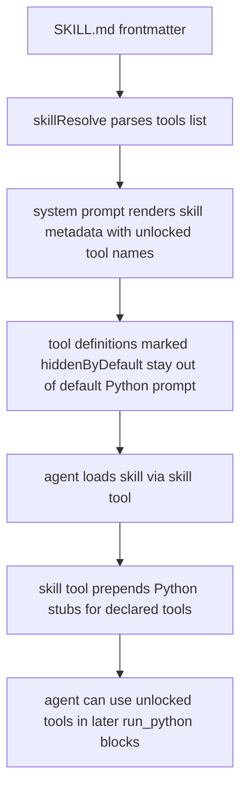

# Skill Tool Unlocks

Skills can now declare a `tools:` frontmatter list that unlocks hidden tool docs on demand.

## Flow

## Notes

- `hiddenByDefault` hides a tool from default system prompt rendering only; it does not disable execution.
- Core skills now declare the specialized tool families they unlock: tasks plus channels/signals, fragments, friends, permanent agents, and psql.
- Skill authoring docs and validators now accept the `tools` frontmatter field.
