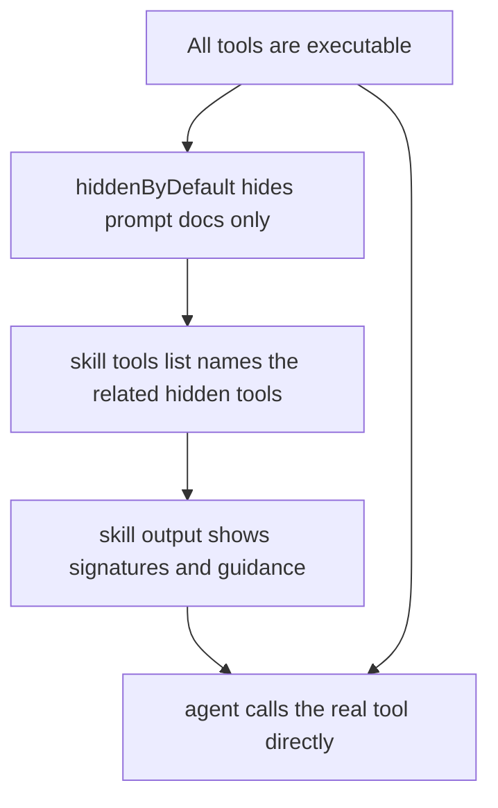

# Skill Tool Visibility

Clarified that skills do not grant access to tools. They only show extra prompt documentation and Python stubs for tools that may be hidden from the default prompt.

## Changes

- Reworded prompt sections so skills document hidden-by-default tools instead of "unlocking" them.
- Reworded `skill` tool output to state that listed tools are already callable.
- Expanded the `tasks` skill tool list so it shows the full task tool family it teaches.
