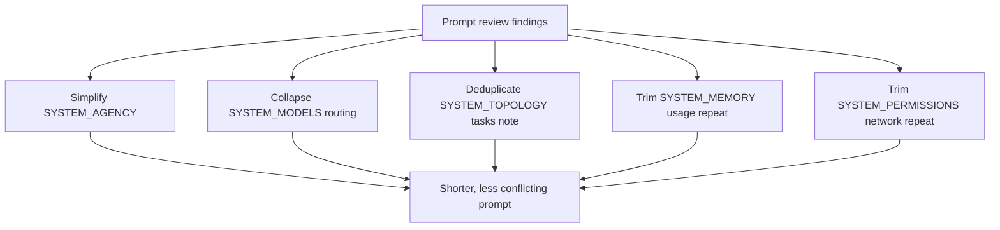

# System Prompt Cleanup

Reduced redundant guidance in the core system prompts so the model sees fewer repeated rules and fewer conflicting delegation instructions.

## Changes

- `SYSTEM_AGENCY.md`: replaced repeated "delegate everything" language with a single rule to use subagents when they improve focus or reliability; replaced the low-signal helpfulness paragraph with a concise artifact-first instruction.
- `SYSTEM_MODELS.md`: removed the repeated vendor prose and table; kept one compact routing heuristic list plus `set_agent_model` guidance.
- `SYSTEM_TOPOLOGY.md`: merged the duplicate `tasks` skill pointer into a single intro paragraph and removed the repeated signals/channels section at the end.
- `SYSTEM_MEMORY.md`: removed the numbered usage pattern that repeated the sync/async guidance already listed above.
- `SYSTEM_PERMISSIONS.md`: removed the repeated network section and kept internet access in the opening summary.
