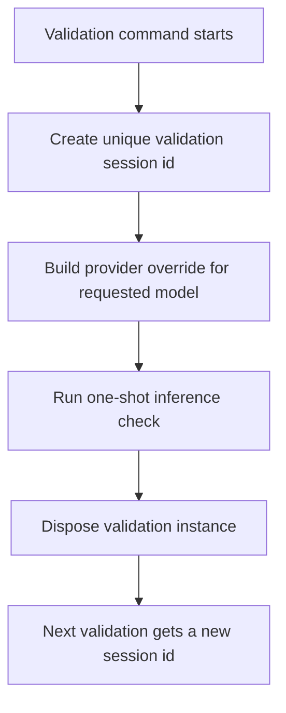

# Validation Session Isolation

Provider and model validation now uses a fresh inference session id for every check.

This avoids sticky backend session state when a provider transport treats `sessionId` as reusable context, which was causing validation runs to behave as if they were still on a previous default or previously tested model.

