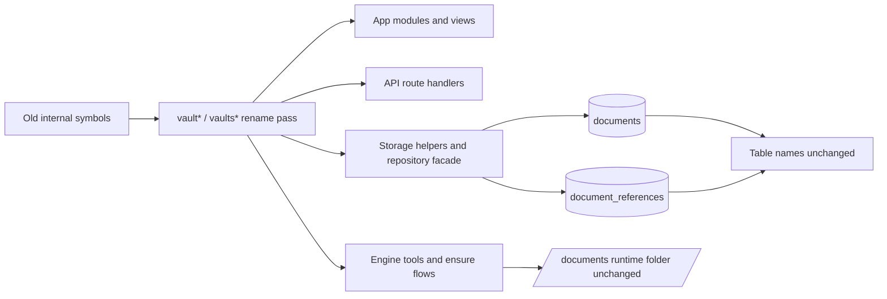

# Vault Internal Symbol Rename

Daycare now uses `vault` and `vaults` for the remaining internal vault-domain file names, exported symbols, helpers, and tests that still used `document` and `documents`.

## Scope

- Renamed vault-domain helpers in app modules, app views, API route handlers, engine tools, storage helpers, and ensure flows.
- Renamed the bundled root prompt asset from `document/DOCUMENT_ROOT.md` to `vault/VAULT_ROOT.md`.
- Left the runtime filesystem folder name as `documents/`.
- Left database table names and row storage compatibility as `documents` and `document_references`.

## Result

- Internal vault-domain code now follows the public `vault` naming more closely.
- Compatibility exceptions remain where storage and filesystem layout must stay stable.
