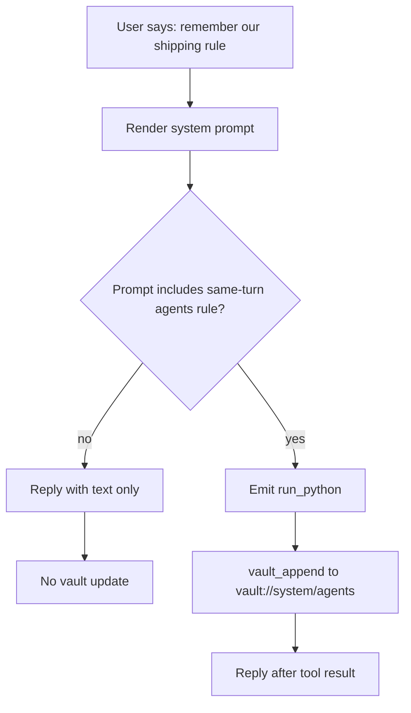

# Same-Turn Vault Persistence Prompt

This change makes the system prompt stricter about durable memory writes:

- durable instructions about how the agent should work must update `vault://system/agents` in the same turn
- stable user facts and preferences must update `vault://system/user` in the same turn
- the agent should not say it will remember something later unless the matching vault update already happened

## Files

- `packages/daycare/sources/prompts/AGENTS.md`
- `packages/daycare/sources/prompts/SYSTEM_MEMORY.md`
- `packages/daycare/sources/engine/agents/ops/agentSystemPrompt.spec.ts`
- `packages/daycare/sources/eval/evalVaultPersistenceExperiment.spec.ts`

## Experiment Design

The experiment is deterministic and prompt-sensitive. It does not require a live model provider.

- The eval harness boots a real `AgentSystem`, real vault tools, and real `run_python`.
- A custom inference router inspects the rendered `systemPrompt`.
- If the prompt contains the new same-turn `vault://system/agents` instruction, the router emits `run_python` code that calls `vault_append(path="vault://system/agents", ...)`.
- If the instruction is absent, the router skips the vault update and replies with plain text only.

## Results

Control:
- Prompt variant: replaced the exact `vault://system/agents` same-turn sentence with weaker wording
- Outcome: no `vault_append` call
- Outcome: `vault://system/agents` stayed unchanged
- Final reply: `I will remember that.`

Treatment:
- Prompt variant: default prompt with the new same-turn sentence intact
- Outcome: `run_python` executed `vault_append`
- Outcome: `vault://system/agents` gained the durable operating rule line
- Final reply: `Saved that operating rule in vault://system/agents.`

## Why This Shape

The experiment uses `run_python` instead of direct model tool calls because production agents execute ordinary tools through the RLM path. That keeps the experiment aligned with real agent behavior while isolating the effect of the prompt wording itself.
