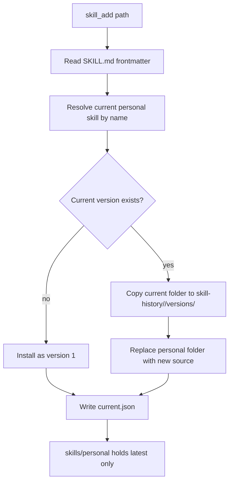

# Versioned User Skills

This change makes personal user skills versioned instead of destructive-on-replace.

## What Changed

- `skill_add` now assigns a monotonically increasing version number per skill name.
- The current version still lives in `users/<userId>/skills/personal/<skill-name>/`.
- Replaced versions move into `users/<userId>/skill-history/<skill-name>/versions/<n>/`.
- The current version number is tracked in `users/<userId>/skill-history/<skill-name>/current.json`.
- `skill_eject` and `POST /skills/eject` can now export a specific version.
- `GET /skills/:id/versions` exposes archived versions to the app API.

## Storage Flow



## Read and Export Flow

```mermaid
flowchart LR
    A[GET /skills/:id/versions] --> B[Resolve user skill]
    B --> C[Read skill-history/<name>/current.json]
    C --> D[List versions/* directories]
    D --> E[Return currentVersion + previousVersions[]]

    F[skill_eject or POST /skills/eject] --> G{version provided?}
    G -->|no| H[Copy current personal folder]
    G -->|yes| I[Copy skill-history/<name>/versions/<n>]
    H --> J[Write destination/<skill-name>]
    I --> J
```
