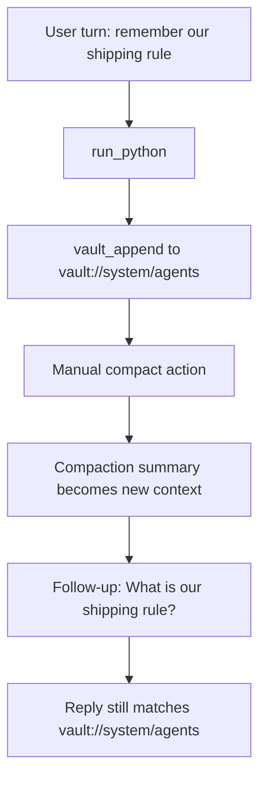

# Compaction Vault Persistence Experiment

This experiment verifies that a durable operating rule stored in `vault://system/agents` remains usable after manual session compaction.

## Files

- `packages/daycare/sources/eval/evalCompactionExperiment.spec.ts`

## Experiment Design

- Boot a real in-process eval harness with real vault tools and real `run_python`.
- First turn: the user says `remember our shipping rule`.
- The synthetic router emits `run_python`, which appends the durable rule to `vault://system/agents`.
- Manual compaction is triggered through the real agent inbox `compact` action.
- After compaction, a follow-up user turn asks for the shipping rule.

## Results

- First turn response: `Saved that operating rule in vault://system/agents.`
- `vault://system/agents` contained the appended shipping rule before compaction.
- Manual compaction returned `{ type: "compact", ok: true }`.
- The active session id changed after compaction, confirming a real session reset.
- The new compacted history started with the compaction summary.
- Post-compaction follow-up response: `Our shipping rule is to write it to vault://system/agents before replying.`

## Why This Matters

This checks the path that matters for durable memory:

- the rule is not just surviving in transient chat history
- compaction does not strip away the updated `vault://system/agents` guidance
- the next turn still sees the persisted rule through normal system-prompt reconstruction
