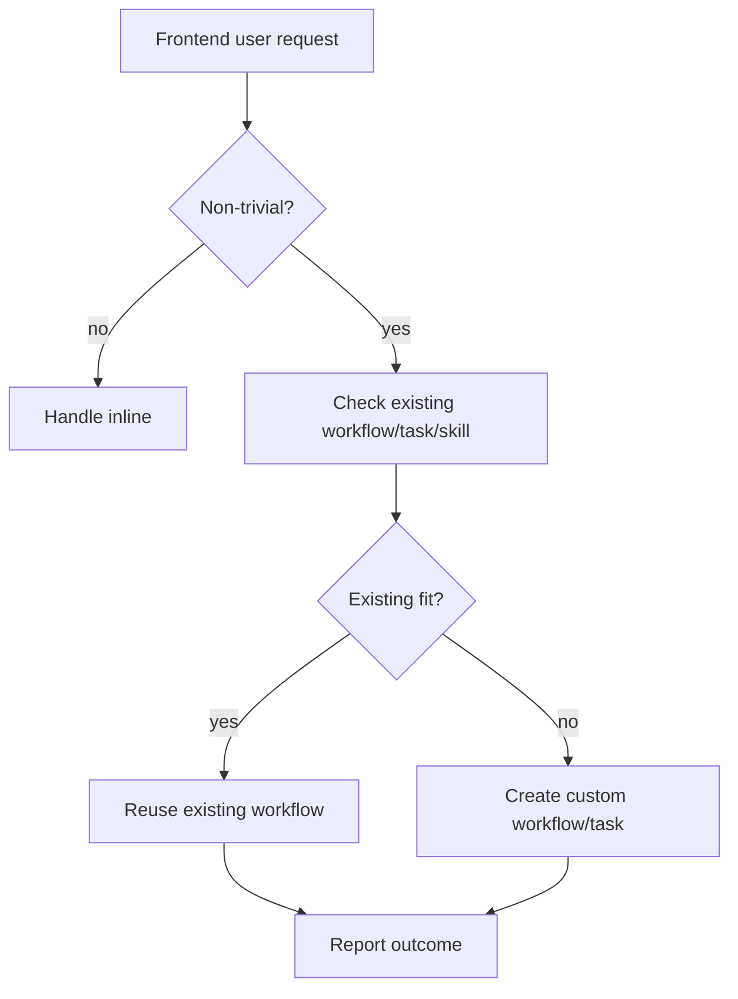

# Frontend Workflow-First Prompt

Strengthened the foreground agent prompt so frontend-facing agents default to reusable workflows instead of ad-hoc inline execution.

## Changes

- `packages/daycare/sources/prompts/SYSTEM_AGENCY.md`
  - tightened the foreground rule to be workflow-first for almost every non-trivial request
  - added explicit wording to reuse an existing workflow whenever it fits
  - added explicit wording to create a custom workflow or reusable task when no fit exists
- `packages/daycare/sources/engine/agents/ops/agentSystemPrompt.spec.ts`
  - adds foreground prompt assertions for the new workflow-first guidance
- `packages/daycare/sources/eval/evalForegroundWorkflowExperiment.spec.ts`
  - runs an eval-harness experiment where a prompt-sensitive mock model chooses `topology` then `task_create` only when the stronger wording is present

## Eval loop

1. Baseline foreground prompt snapshot showed the new explicit phrases were absent.
2. Baseline eval fell back to an inline response instead of reusing or creating a workflow.
3. After the prompt change, the eval experiment routes through `topology` and then `task_create`.
