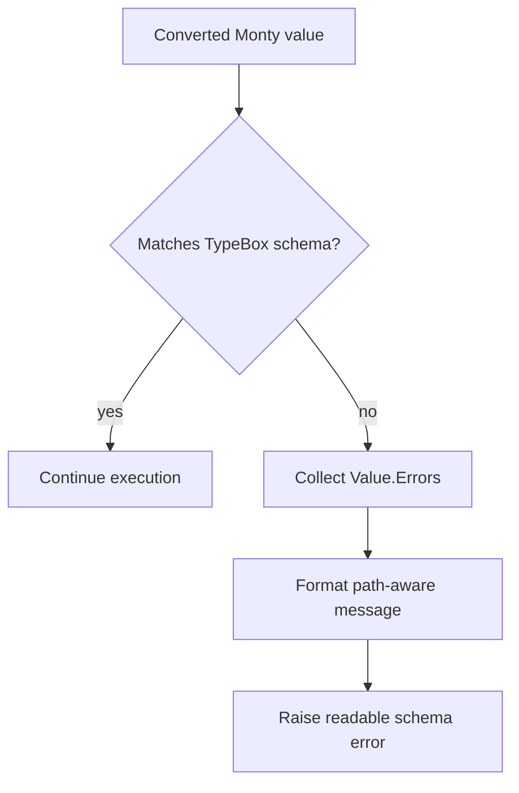

# Monty Schema Error Details

## Summary

Monty argument and response validation used to collapse all post-conversion schema failures into a generic message. That made real issues such as missing required `psql_schema.fields[].comment` properties hard to diagnose.

This update formats TypeBox validation failures into path-aware error messages for both:

1. Python tool arguments converted into JS
2. JS tool responses converted back into Python-safe values

## Flow

