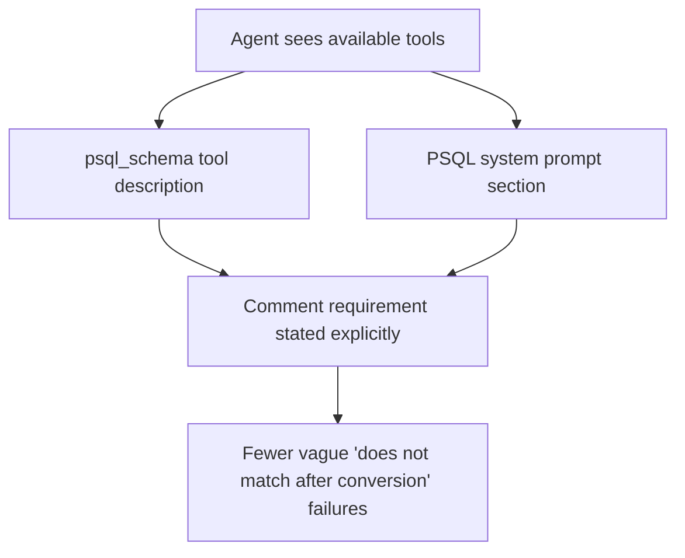

# PSQL Schema Comment Prompting

## Summary

Agents could miss that `psql_schema` requires both a table comment and a non-empty comment for every field. The schema enforced it, but the agent-facing prompt surfaces did not say it clearly unless the `psql` skill was loaded.

This update adds the requirement to:

1. The `psql_schema` tool description
2. The PSQL system prompt section injected for agents

## Flow

