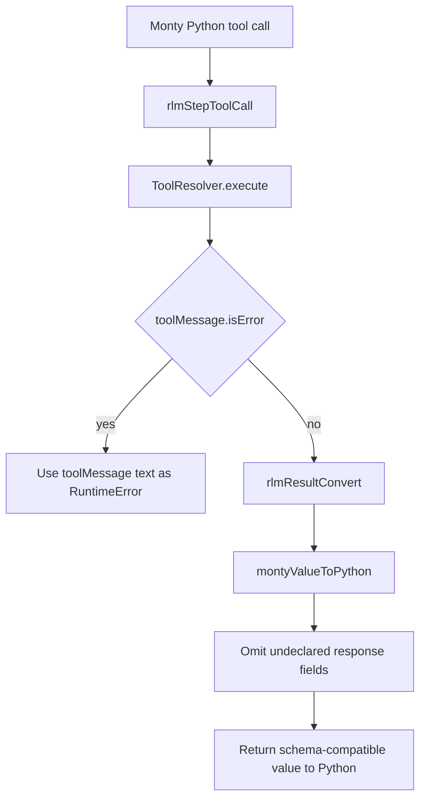

# RLM Tool Error Schema Handling

## Summary

Background Python tool calls were forcing every tool response through the tool's declared success schema, even when `ToolResolver` returned a generic error payload. That caused errors like `response.toolCallId is not allowed by the schema` to replace the real tool failure.

The fix does two things:

1. Failed tool calls now raise from `toolMessage` text directly instead of schema-converting the generic error payload.
2. Successful response conversion now omits undeclared response fields instead of throwing on them.

## Flow

## Result

The Python bridge now preserves the original tool failure text for blocked or failed tools, and large or noisy success payloads no longer fail just because they include extra response fields.
