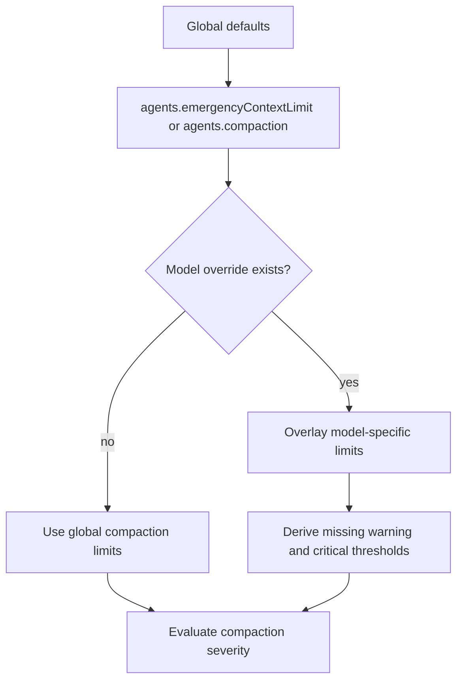

# Model-Aware Compaction Limits

Daycare compaction thresholds are now configurable in `settings.json` and can be overridden per `provider/model`.

## Why

The old behavior used a single global `agents.emergencyContextLimit` with hard-coded warning and critical ratios.
That forced early compaction for larger-context models like `anthropic/claude-opus-4-6` unless operators patched code.

## Settings format

```json
{
  "agents": {
    "compaction": {
      "emergencyLimit": 200000,
      "warningLimit": 150000,
      "criticalLimit": 180000,
      "models": {
        "anthropic/claude-opus-4-6": {
          "emergencyLimit": 1000000
        },
        "anthropic/claude-sonnet-4-6": {
          "warningLimit": 700000,
          "criticalLimit": 850000
        }
      }
    }
  }
}
```

Notes:

- `agents.compaction.emergencyLimit` overrides `agents.emergencyContextLimit` for compaction. If
  `agents.compaction.emergencyLimit` is unset, Daycare falls back to `agents.emergencyContextLimit`.
- A per-model `emergencyLimit` automatically derives `warningLimit` and `criticalLimit` when they are omitted.
- If a model override only sets `warningLimit` and/or `criticalLimit`, the model keeps the global `emergencyLimit`.
  Daycare does not reverse-derive `emergencyLimit` from `warningLimit` or `criticalLimit`.
- Model keys use the existing `provider/model` convention from role and flavor settings.

## Resolution flow



## Runtime impact

- Automatic pre-turn compaction now resolves limits from the active provider/model.
- Emergency reset checks can use the same model-aware thresholds.
- Existing installs keep the same default behavior until compaction settings are added.
