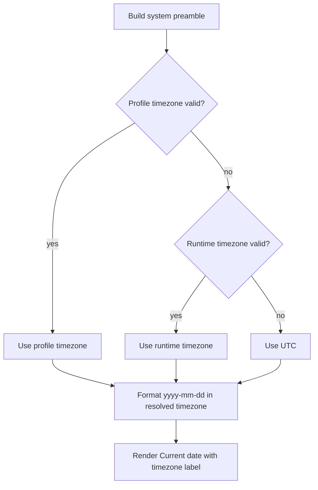

# System Prompt Local Date Timezone

## What changed

- The system prompt preamble now formats `Current date` in a resolved local timezone instead of using the UTC calendar date.
- The rendered date line now includes the timezone string so the model can see which calendar is being used.
- Timezone resolution prefers the user's valid profile timezone, then the runtime timezone, then `UTC`.

