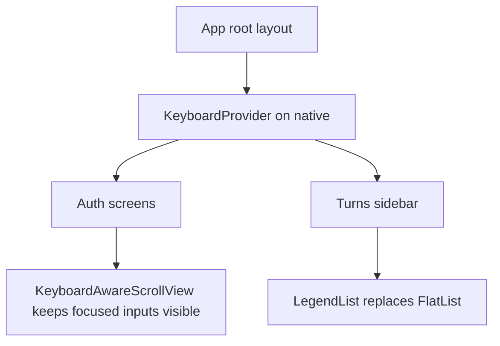

# Daycare App Keyboard Controller And Legend List

## Summary

The app now includes two non-Expo UI libraries for native interaction quality and list performance:

- `react-native-keyboard-controller`
- `@legendapp/list`

This change wires keyboard handling into the app shell and auth forms, and replaces the turns sidebar `FlatList` with `LegendList`.

## Flow

## Notes

- `react-native-keyboard-controller` is enabled only on native platforms from the app root provider.
- `@legendapp/list` is currently used in the turns panel as a low-risk first integration point.
- The chat timeline still uses `FlatList`; moving it to Legend List should be a separate pass because it currently depends on inverted chat semantics.
