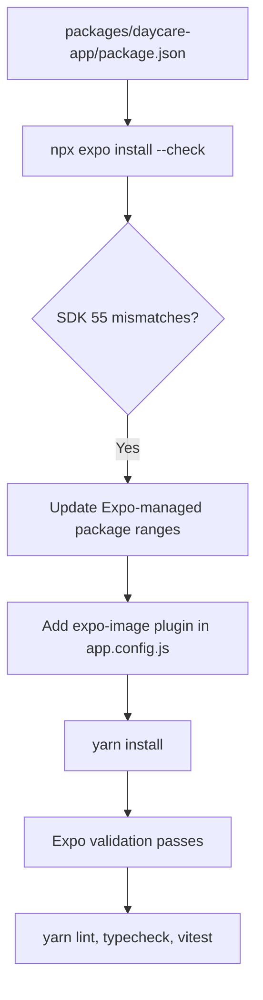

# Daycare App SDK 55 Package Alignment

## Summary

The `daycare-app` workspace had drifted from the Expo SDK 55 package set.
This change realigns the app with Expo's current SDK 55 expectations and adds the `expo-image` config plugin required by the updated package install flow.

Changes:
- Bumped `expo` to `~55.0.5` which resolved to `55.0.6`.
- Bumped `expo-image` to `~55.0.6`.
- Bumped `expo-router` to `~55.0.5`.
- Bumped `expo-splash-screen` to `~55.0.10`.
- Pinned `react-native-webview` to `13.16.0` to match the SDK 55 validation set.
- Registered `"expo-image"` in `packages/daycare-app/app.config.js`.
- Relaxed the direct `@react-navigation/native` declaration to `^7.1.28` so Expo validation passes while Yarn resolves the current patch release.

## Flow

## Remaining Audit Notes

- `npx expo-doctor` still reports duplicate native packages from the Yarn 1 workspace layout and nohoist setup.
- The remaining app dependency drift outside Expo-managed packages should be handled separately, especially native integrations such as LiveKit, WebRTC, ElevenLabs, and Unistyles.
