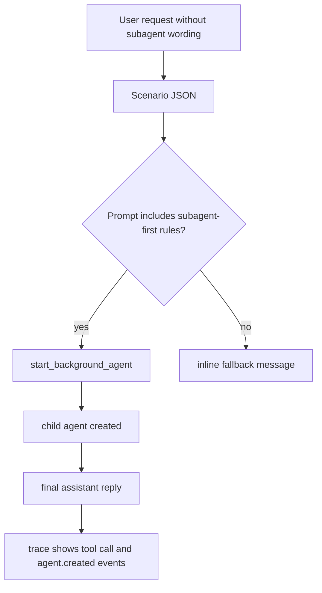

# Foreground Subagent-First Eval

Added a scenario-driven eval path for prompt-sensitive mock inference, then used it to tighten the foreground prompt so non-trivial requests start a background subagent without the user having to ask for one explicitly.

## Changes

- `packages/daycare/sources/eval/evalScenario.ts`
  - adds optional scripted `inference` steps to scenario JSON so evals can stay inside the dedicated subsystem
- `packages/daycare/sources/eval/evalInferenceRouterScenarioBuild.ts`
  - builds a deterministic prompt-sensitive mock router from scenario-defined branches
- `packages/daycare/sources/eval/evalCli.ts`
  - wires scenario-defined inference into the normal `yarn eval` flow
- `packages/daycare/sources/eval/evalTraceRender.ts`
  - renders assistant tool calls so traces show `start_background_agent(...)` directly
- `packages/daycare/sources/eval/scenarios/foreground-subagent-first.json`
  - standard eval scenario used to verify foreground subagent startup
- `packages/daycare/sources/prompts/SYSTEM_AGENCY.md`
  - makes foreground agents subagent-first for almost every non-trivial request while preserving the foreground-only software-development boundary

## Eval Loop

1. Add scenario-defined scripted inference to the eval subsystem instead of a standalone experiment spec.
2. Create a foreground request that does not mention subagents.
3. Make the scripted router call `start_background_agent` only when the system prompt contains the stronger subagent-first wording.
4. Run `yarn eval packages/daycare/sources/eval/scenarios/foreground-subagent-first.json .context/foreground-subagent-first.trace.md`.
5. Verify the trace shows the `start_background_agent(...)` tool call and the follow-up assistant reply confirming the background handoff.
