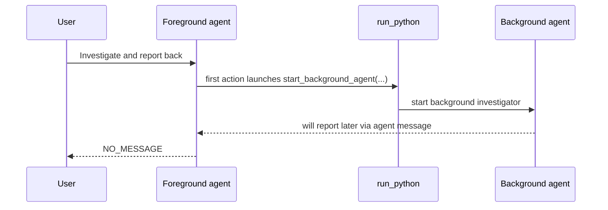

# Silent Handoff Prompt Tightening

This change tightens the foreground prompt so a silent background delegation stays fully silent:

- launch background work first
- avoid pre-tool narration like "I'll investigate"
- return exactly `NO_MESSAGE` when there is nothing user-visible to say

## Flow

## Prompt effect

The prompt now makes two constraints explicit:

1. The first substantive foreground action for non-trivial investigation should be starting background work, including when that launch happens inside `run_python`.
2. If the agent intends to end the turn with `NO_MESSAGE`, it must not emit any user-facing setup narration anywhere else in the turn.
