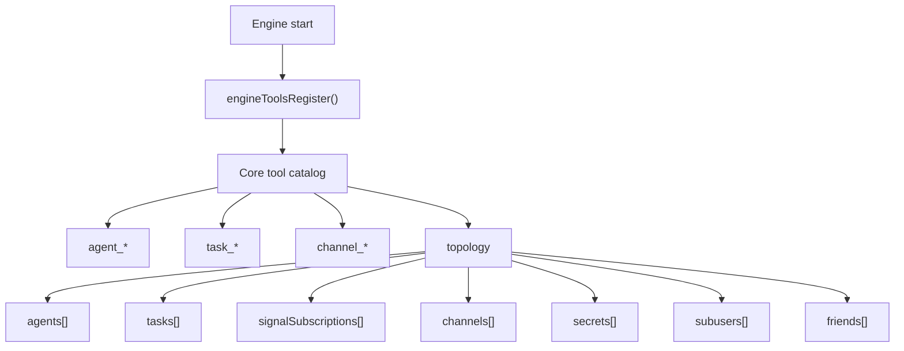

# Remove ACP Tools

## Summary

The ACP session subsystem has been removed from Daycare core.

- Removed the `acp_session_start` and `acp_session_message` tools.
- Removed the in-memory ACP runtime and its engine boot/shutdown wiring.
- Simplified `topology` so it no longer reports ACP session state.
- Dropped the unused `@agentclientprotocol/sdk` dependency.

## Runtime Shape

## Notes

- Eval harness coverage now expects the reduced core tool catalog.
- ACP session documentation was removed with the implementation because those APIs no longer exist.
