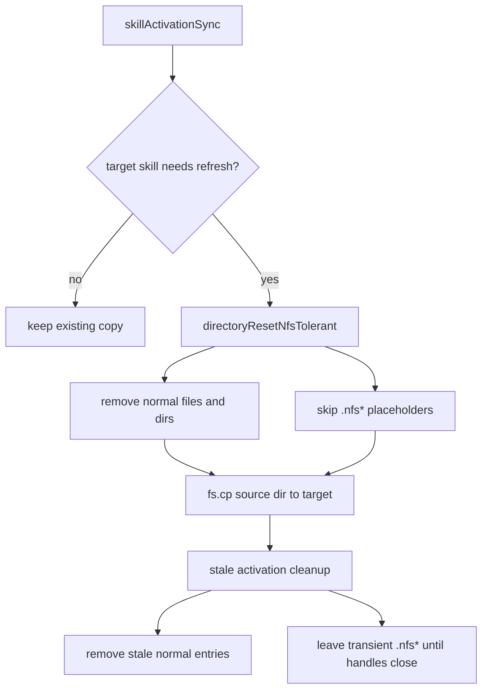

# Skill Activation NFS Copy Tolerance

The active skill sync now avoids recursive directory deletion when refreshing a copied skill.

On NFS, deleting a file that is still open by another process can produce a transient `.nfs*` placeholder. A later recursive delete can fail with `EBUSY` while that placeholder is still open.

The activation refresh now:

- removes ordinary files from the target skill directory
- leaves transient `.nfs*` entries in place
- copies the current source skill over the cleaned target directory
- cleans stale activation directories on a best-effort basis, leaving only transient `.nfs*` placeholders when needed

