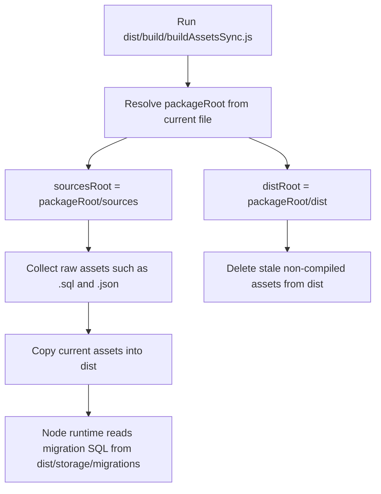

# Build Asset Root Resolution

## Summary
- Fixed `buildAssetsSync` so it resolves the package root first, then always copies raw assets from `packages/daycare/sources` into `packages/daycare/dist`.
- This keeps SQL migrations and other non-TypeScript assets available when the build step runs from `dist/build/buildAssetsSync.js`.
- Docker startup was failing because the compiled runtime expected SQL migrations in `dist/storage/migrations`, but the post-build asset copier was reading from `dist` instead of `sources`.

## Flow

