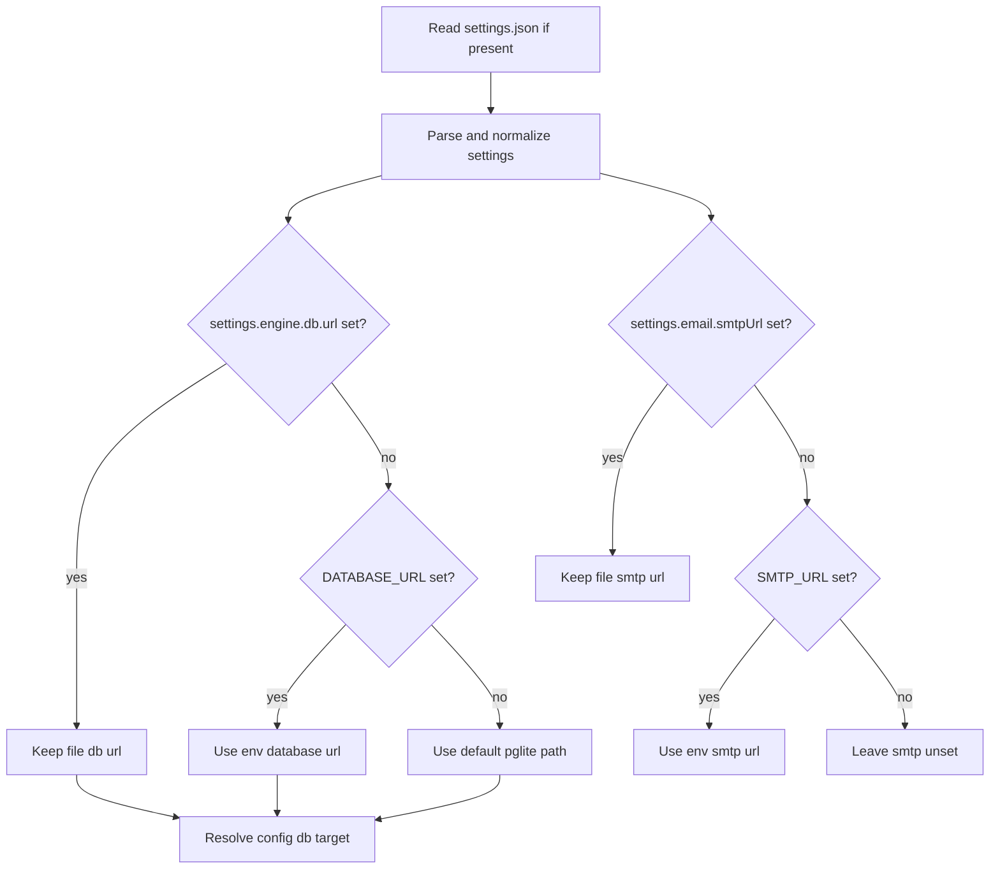

# Database URL Env Override

## Summary
- Added `DATABASE_URL` as a runtime fallback for `settings.engine.db.url`.
- Added `SMTP_URL` as a runtime fallback for `settings.email.smtpUrl`.
- Kept the settings file authoritative when it already provides a non-empty `engine.db.url`.
- Kept the settings file authoritative when it already provides a non-empty `email.smtpUrl`.
- Applied both fallbacks in `readSettingsFile()` and `configLoad()` so file-backed commands and normal startup follow the same rule.

## Resolution Flow

