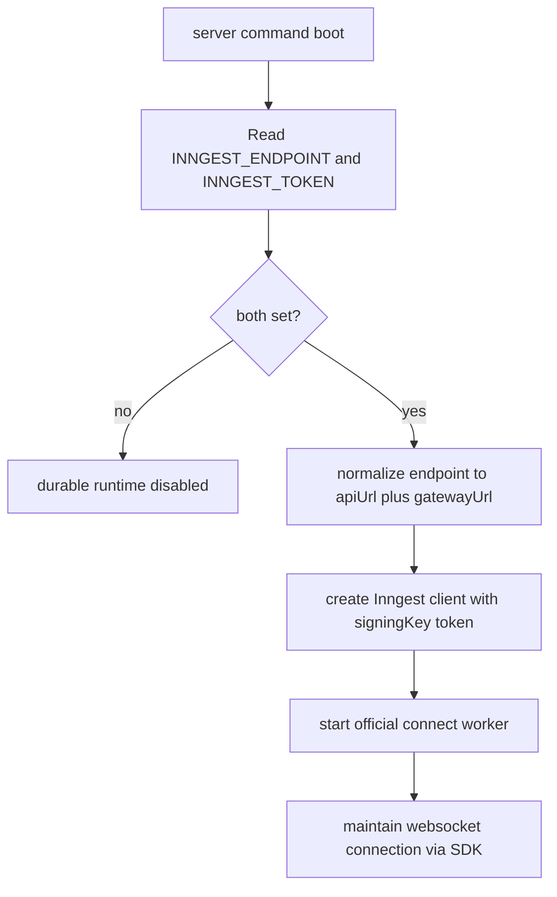

# Durable Runtime

## Summary
- Added a dedicated `sources/durable/` runtime for server mode.
- The durable runtime enables itself only when both `INNGEST_ENDPOINT` and `INNGEST_TOKEN` are present in the process environment.
- It uses the official Inngest TypeScript SDK v4 `connect()` worker runtime.
- It normalizes the configured endpoint into an API base URL plus a websocket gateway URL and starts the worker in server mode.

## Flow

