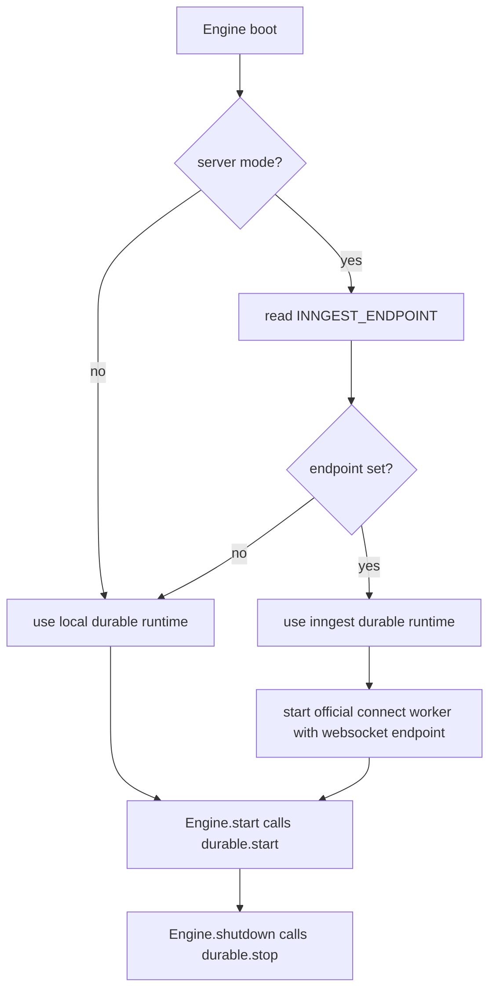

# Durable Runtime

## Summary
- Added a dedicated `sources/durable/` runtime for server mode.
- Added an engine-owned durable abstraction with `local` and `inngest` implementations.
- The durable runtime enables the `inngest` implementation only in server mode and only when `INNGEST_ENDPOINT` is present in the process environment.
- It uses the official Inngest TypeScript SDK v4 `connect()` worker runtime.
- `INNGEST_ENDPOINT` is the websocket endpoint used directly by `connect()`.
- The endpoint is used as-is; query parameters are preserved and not interpreted by Daycare.

## Flow

