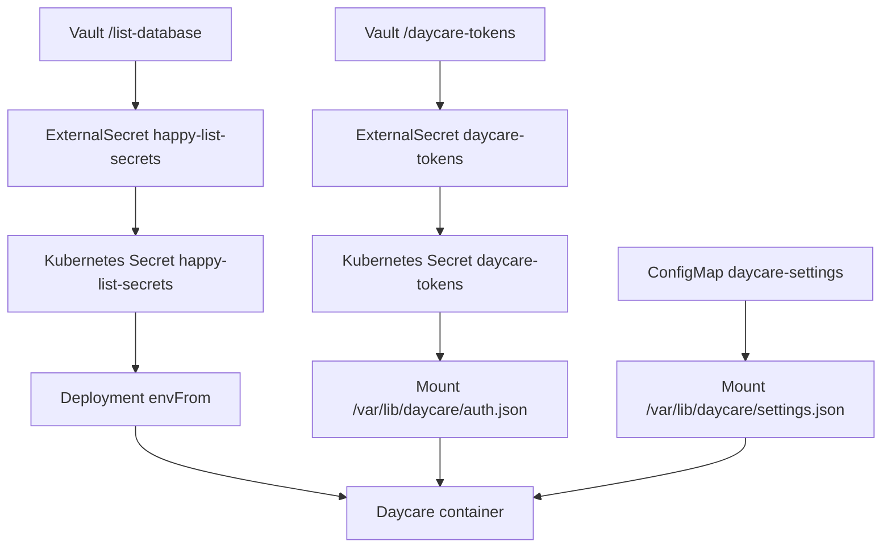

# Kubernetes Secrets And Config Mounts

## Summary
- Added an `ExternalSecret` named `happy-list-secrets` that syncs `/list-database` and can be consumed with `envFrom`.
- Added a second `ExternalSecret` named `daycare-tokens` so `auth.json` can be mounted as a file inside the container.
- Added a `ConfigMap` named `daycare-settings` that provides `settings.json` and mounts it next to `auth.json` under `/var/lib/daycare`.
- Updated the Daycare deployment to consume env secrets and mount both config files.

## Mount Flow

