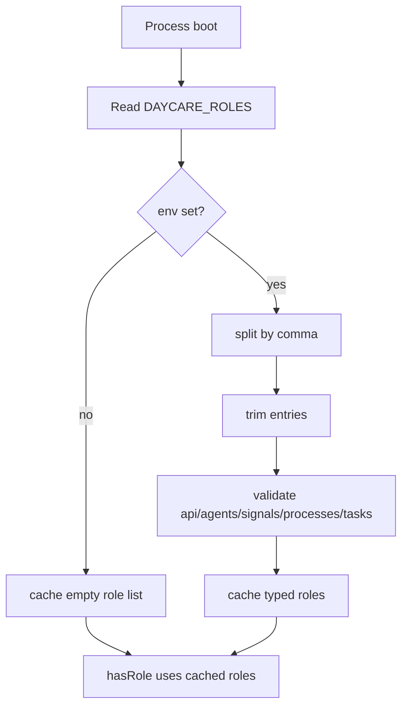
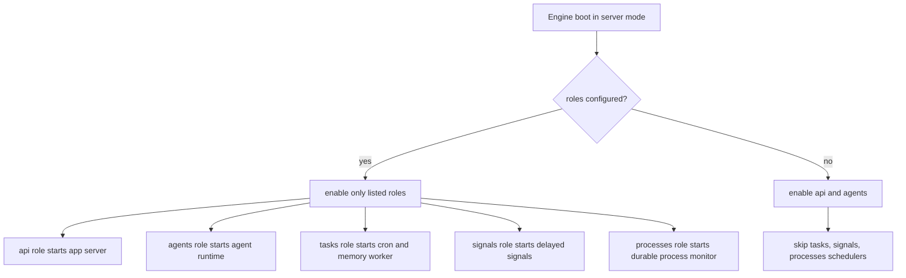

# Process Roles

## Summary
- Added a global `hasRole()` runtime helper for process-level role checks.
- Roles come from `DAYCARE_ROLES` as a comma-separated environment variable.
- Roles are resolved once at boot and cached for the current Node.js process.
- Roles are strictly typed as `api`, `agents`, `signals`, `processes`, or `tasks`; unknown entries fail fast during boot.
- When `DAYCARE_ROLES` is unset or blank, the process has no explicit roles.
- In server mode, an empty role list keeps `api` and `agents` enabled but leaves scheduler-style work disabled.

## Resolution

## Server Runtime Defaults

