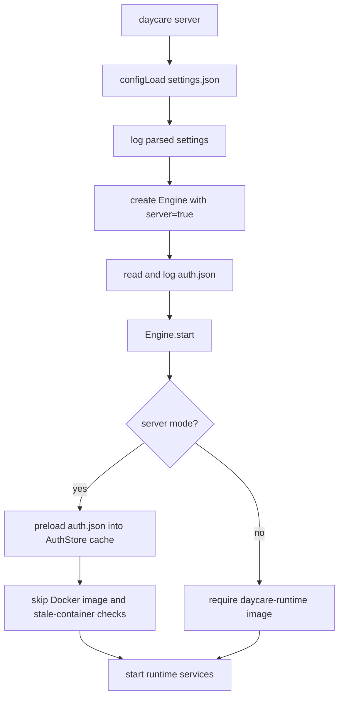

# Server Command Mode

## Summary
- Updated `daycare server` to load config, print parsed `settings.json`, print loaded credentials from `auth.json`, and start the runtime.
- Added an `Engine` `server` flag so server boot can alter startup behavior.
- Server mode skips local Docker runtime image checks and stale container cleanup during startup.
- Server mode preloads `auth.json` once during boot and serves later auth reads from memory instead of re-reading the file.

## Boot Flow

