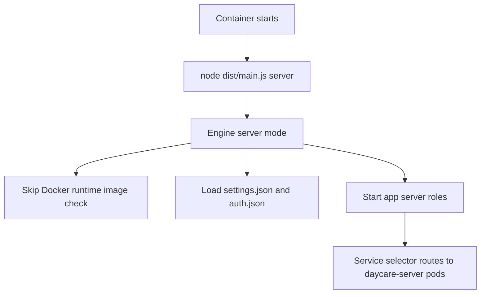

# Server Deployment Entrypoint

## Summary
- Switched the container runtime entrypoint from `daycare start` to `daycare server`.
- Made the Kubernetes `Deployment` command explicit so cluster startup does not depend on image defaults.
- Fixed the `Service` selector to target `app: daycare-server`, matching the pod labels.

## Why
- `start` is the local desktop/runtime mode and expects the Docker-backed sandbox image plus the local IPC server path.
- `server` is the deployment mode and skips the Docker startup checks that fail in containers without `/var/run/docker.sock`.

## Flow

