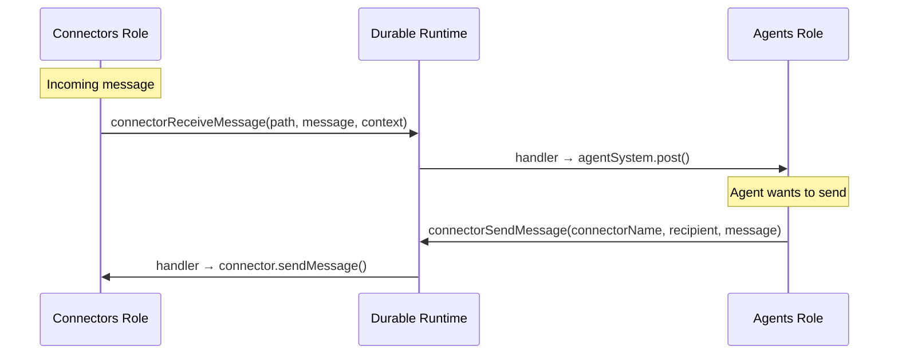

# Connectors Role

**Date:** 2026-03-18

## Summary

Added a `connectors` runtime role that owns connector lifecycle and exposes
durable functions for cross-role message send/receive.

## Motivation

Splitting connector work into its own role allows horizontal scaling: one
process group runs connectors (long-lived WebSocket/polling connections),
another runs agent inference. Durable functions bridge the two so neither
needs in-process access to the other.

## Architecture

## Changes

### New role: `connectors`

Added to `DAYCARE_ROLE_VALUES` in `hasRole.ts`. Included in
`SERVER_DEFAULT_ROLES` so existing single-process deployments keep working.

### Durable functions

| Name | Enabled roles | Purpose |
|------|--------------|---------|
| `connectorSendMessage` | `connectors` | Send text/files through a named connector |
| `connectorReceiveMessage` | `agents` | Append incoming connector message to agent inbox |

### Engine gating

- Plugin load/start/stop gated on `connectors` role
- Incoming message path uses `connectorReceiveMessage` durable function when
  a durable runtime is active, falls back to direct `agentSystem.post()` for
  dev/test mode

### DurableFunctionServices

Extended with:
- `connectorRegistry` — look up connectors by name (for send)
- `agentPost` — post inbox items to agents (for receive)

## Files changed

| File | Change |
|------|--------|
| `sources/utils/hasRole.ts` | Added `"connectors"` to role values |
| `sources/durable/durableFunctions.ts` | Added two durable function definitions and extended services type |
| `sources/durable/durableExecute.ts` | Pass new services through to handlers |
| `sources/durable/durableFunctions.spec.ts` | Tests for new functions and role filtering |
| `sources/engine/engine.ts` | Gate plugins on connectors role, route receives through durable function, add `connectorReceive` helper |
| `sources/engine/agents/agent.spec.ts` | Stub new services in test harness |
| `sources/engine/agents/agentSystem.spec.ts` | Stub new services in test harness |
| `sources/engine/signals/delayedSignals.spec.ts` | Stub new services in test harness |
