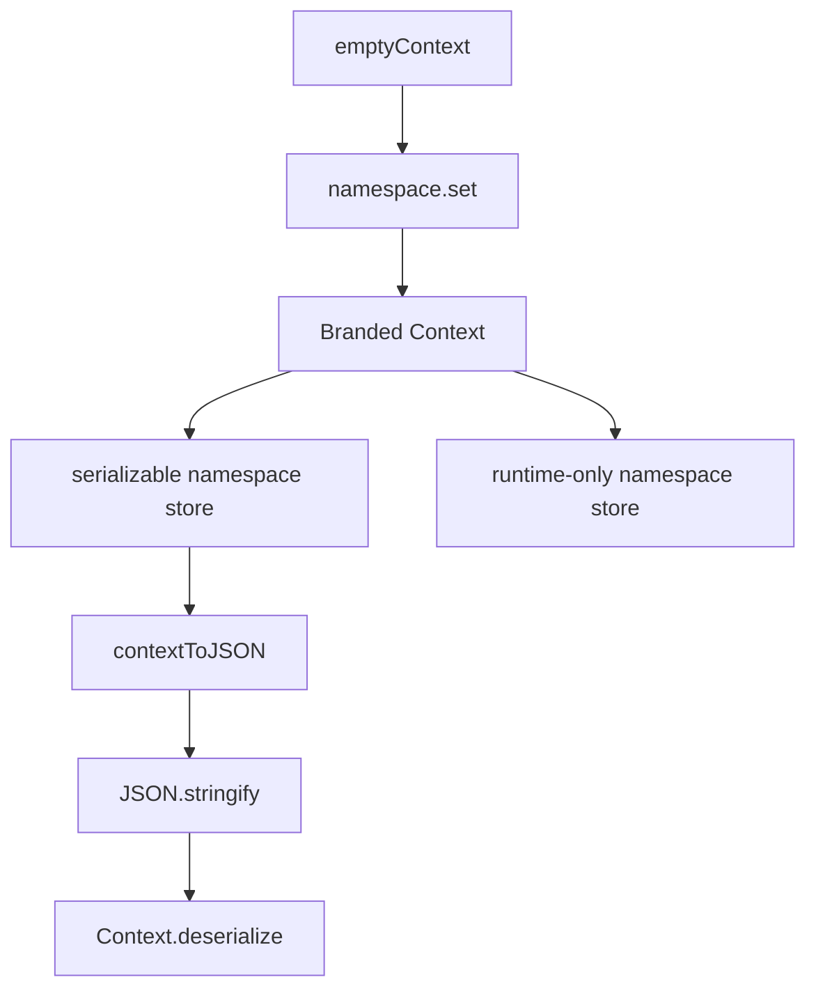

# Context Namespaces

The `Context` implementation is a single file at `packages/daycare/sources/engine/agents/context.ts`.

All stored values live behind a private symbol and the class is branded, so `Context` is no longer a structural plain object.

A small `createContextNamespace()` helper follows the `@openland/context` style:
- `emptyContext` is the immutable base
- `namespace.get(ctx)` reads a value
- `namespace.set(ctx, value)` returns a new `Context`
- namespaces can be marked `serializable: false`
- built-in namespaces are exported in `contexts`

The class still exposes explicit getters such as `userId`, `agentId`, `personUserId`, `durable`, and `hasAgentId`, but those values are backed by the namespace store instead of public fields.

Serialization is plain JSON for serializable namespaces only: `contextSerialize(ctx)` returns `JSON.stringify(contextToJSON(ctx))`, and `Context.deserialize(serialized)` restores directly from that object shape. Runtime-only namespaces are kept in memory and dropped by `toJSON()` and `serialize()`.

```ts
import { Context, createContextNamespace, emptyContext } from "@/types";

const logNamespace = createContextNamespace<string>("log", "main");

function withLog(ctx: Context, name: string): Context {
    return logNamespace.set(ctx, name);
}

let ctx = withLog(emptyContext, "root");
ctx = withLog(ctx, "request");
```


