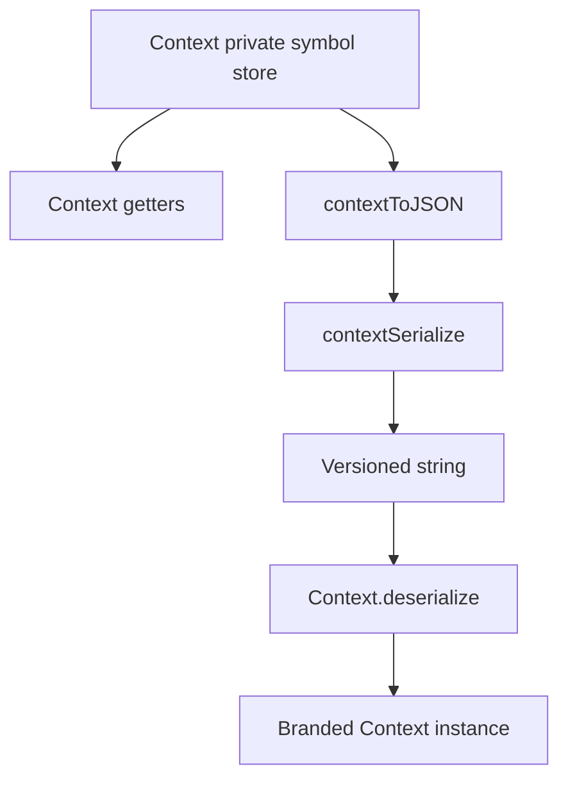

# Context Namespaces

The `Context` implementation is a single file at `packages/daycare/sources/engine/agents/context.ts`.

All stored values live behind a private symbol and the class is branded, so `Context` is no longer a structural plain object.

A fixed `Contexts` type enumerates the allowed typed context values:
- `agentId`
- `personUserId`
- `durable`

The class exposes explicit getters such as `agentId`, `personUserId`, `durable`, and `hasAgentId`, but those values are read from the internal `contexts` map instead of public fields.

Serialization is versioned and string-based via `contextSerialize(ctx)` and `Context.deserialize(serialized)`. Structured transport still goes through `contextToJSON(ctx)`, which now emits `{ userId, contexts }`.

