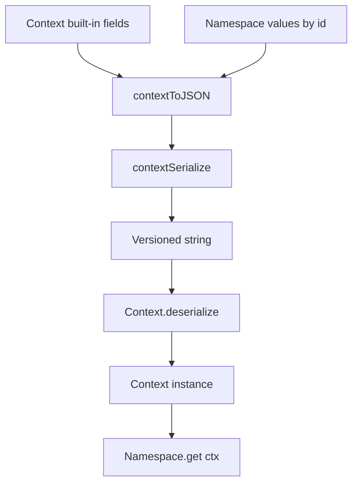

# Context Namespaces

The `Context` implementation now lives in `packages/daycare/sources/engine/agents/context/` as its own domain.

Built-in fields stay on the `Context` class:
- `userId`
- `personUserId`
- `agentId`
- `durable`

Extra serializable fields move through typed namespaces created with `contextNamespaceCreate()`. This keeps the common identity fields explicit while allowing narrow extensions without growing the base class.

Serialization is versioned and string-based via `contextSerialize(ctx)` and `Context.deserialize(serialized)`. The older structured JSON helpers remain available for durable transport and other existing callsites.

