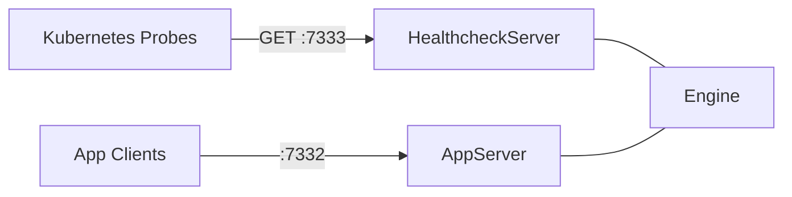

# Healthcheck Server

Dedicated HTTP healthcheck server for Kubernetes probes, independent of the app server.

## Architecture

## Design

- Runs on port `7333` (`0.0.0.0`), always available in server mode
- Returns `{"status":"ok"}` with HTTP 200 on any request
- Starts after `engine.start()` completes, so probes reflect actual readiness
- Independent of the `api` role — works even when the app server is disabled
- Graceful shutdown via `onShutdown` hook

## Ports

| Port | Service | Role-dependent |
|------|---------|----------------|
| 7331 | Dashboard plugin | Yes (connectors) |
| 7332 | App server | Yes (api) |
| 7333 | Healthcheck | No (always on in server mode) |

## Deployment

Kubernetes probes in `deploy.yaml` target port `7333`:

- **startupProbe**: confirms the engine has started
- **readinessProbe**: confirms the process is ready for traffic
- **livenessProbe**: confirms the process is alive
