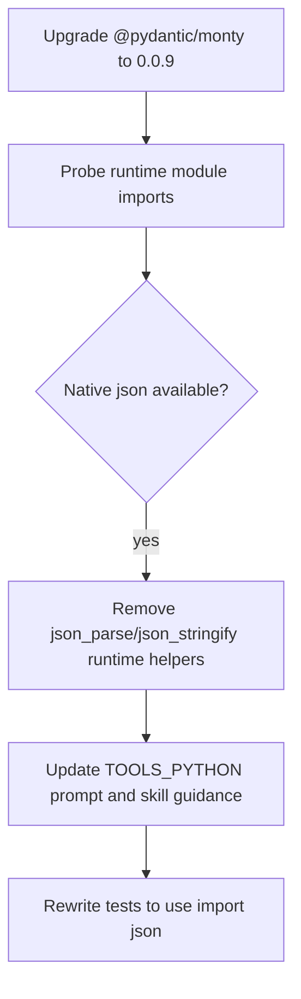

# Monty 0.0.9 JSON Module Alignment

Upgraded Daycare's Monty dependency from `@pydantic/monty@0.0.8` to `0.0.9` and aligned the inline Python runtime with the modules verified in the published package.

Verified against the actual `0.0.9` runtime:

- supported: `typing`, `os`, `pathlib`, `sys`, `math`, `re`, `json`, `datetime`, `asyncio`
- unsupported: `collections`, `itertools`, `random`, `dataclasses`

The synthetic `json_parse(...)` and `json_stringify(...)` RLM runtime helpers were removed because native `import json` now covers that use case directly.

